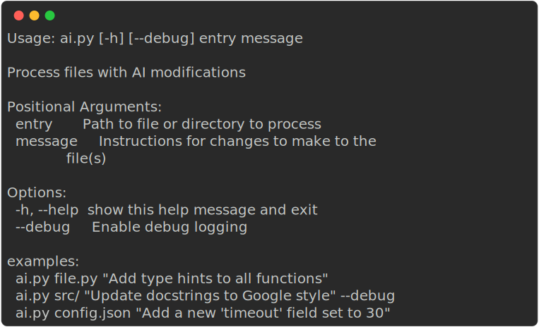
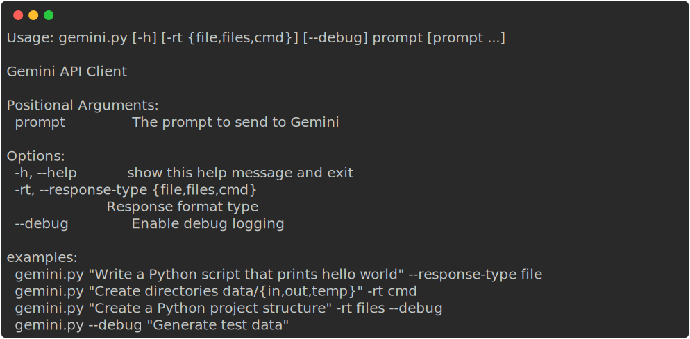
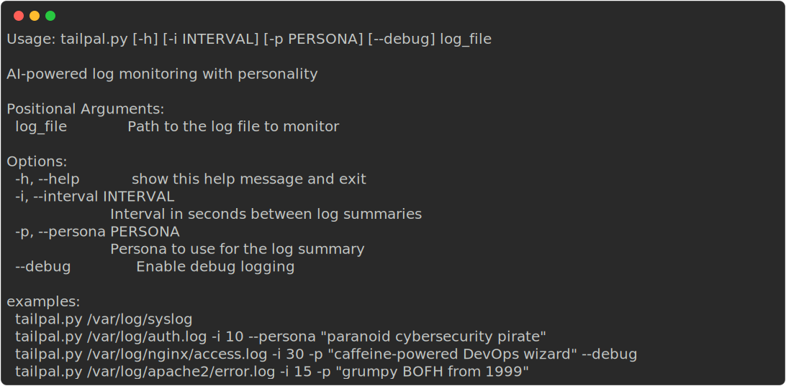

# Description

A collection of utility scripts and bash files that are executed by bashrc to make various tools and commands available across systems. The project serves as a central location for personal command-line tools and utilities.

[//]: # (START_HELP)

## Available Commands

### ai *[(--help)](docs/scripts/ai.md)*

### gemini *[(--help)](docs/scripts/gemini.md)*

### tailpal *[(--help)](docs/scripts/tailpal.md)*

[//]: # (END_HELP)

## Setup

These scripts are automatically loaded and made available through your bashrc configuration. If you're setting up on a new system, ensure the repository is cloned and properly referenced in your `.bashrc` file.

## Requirements

- For AI-related commands: `GEMINI_API_KEY` environment variable must be set
